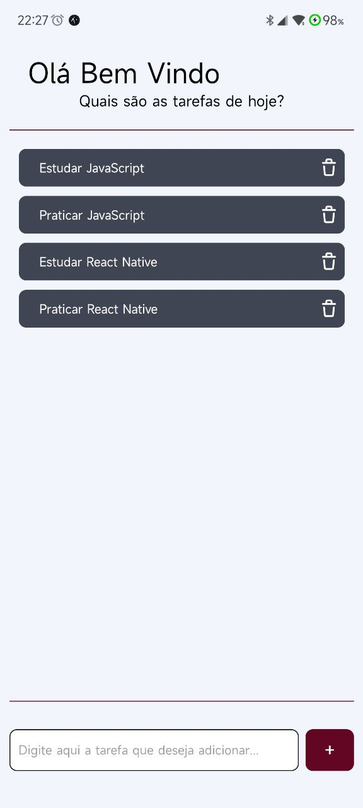

<h1 align="center">
  MyTask's
</h1>

 
  <a>Sobre</a> •
  <a>Tecnologias</a> • 
  <a>Configurações</a> • 
  <a>Funcionalidades</a> • 
  <a>Autor</a> • 

---

 

## 💻 Projeto

MyTask`s é um projeto onde pratico meus conhecimento em React Native e Firebase.

 

  <h1>
    
    
    
    
  </h1>
  

 

## Tecnologias

Esse projeto foi desenvolvido com as seguintes tecnologias:

[✔️Expo](https://docs.expo.dev/)

[✔️Expo Vector Icons](https://docs.expo.dev/guides/icons/)

[✔️React Native](https://docs.expo.dev/)

[✔️Firebase](https://firebase.google.com/docs)

[✔️React Native Animatable](https://github.com/oblador/react-native-animatable)

 

---

## ⚙ Configuração

1- Para instalar as dependências:

> yarn install

2- Para iniciar a aplicação:

> npx expo start

 

---

## Funcionalidades

- [x] Cadastrar usuario
- [x] Logar Usuario
- [x] Gravar tarefa no Banco de Dados
- [x] Ler as Tarefas no banco de Dados
- [x] Atualizar as Tarefas no banco de Dados

 

---
